数値流体力学第6回講義 非構造格子系の手法 (**有限体積法・有限要素法など**)
による流体解析 (2)
三目直登

| 第1回   | 数値シミュレーションと数値流体力学の概観                           |
|---------|--------------------------------------------------------------------|
| 第2回   | 構造格子系の手法 (差分法など) による流体解析 (1)                   |
| 第3回   | 構造格子系の手法 (差分法など) による流体解析 (2)                   |
| 第4回   | 構造格子系の手法 (差分法など) による流体解析 (3)                   |
| 第5回   | 非構造格子系の手法 (有限体積法・有限要素法など) による流体解析 (1) |
| 第6回   | 非構造格子系の手法 (有限体積法・有限要素法など) による流体解析 (2) |
| 第7回   | 格子を用いない手法 (粒子法など) による流体解析 (1)                 |
| 第8回   | 格子を用いない手法 (粒子法など) による流体解析 (2)                 |
| 第9回   | 数値計算プログラミング演習                                         |
| 第10回  | 移動境界問題・流体構造連成問題の数値解析                           |

Y. Bazilevs, K. Takizawa and T.E. Tezduyar, Computational Fluid– Structure Interaction, Wiley, 2013.

Y. Bazilevs, K. Takizawa and T.E. Tezduyar,
(訳: 津川 祐美子, 滝沢研二), 流体-**構造連成** 問題の数値解析, 森北出版\*\*, 2015.\*\*

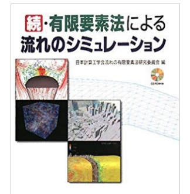

日本計算工学会流れの有限要素法研究委員会, 続・有限要素法による流れのシミュレーション, シュプリンガージャパン\*\*, 2008.\*\*

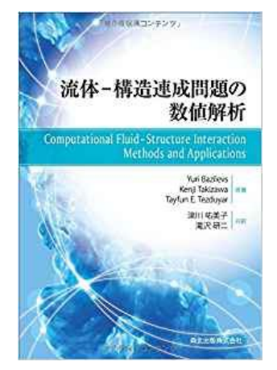

# 差分法と有限体積法

| -          | 座標系に沿った構造格子を使用 - Taylor 展開をベースに微分演算子を近似 非圧縮流れ解析 のための戦略                                      |                                                                |
|------------|---------------------------------------------------------------------------------------------------------------------------------------|----------------------------------------------------------------|
| 差分法     | - Staggered 格子を使用 - 保存性を担保する工夫                                                                                         | - 格子間のフラックス (流束)  を表していると解釈するこ とも可能 |
| -          | 非構造格子 (コントロールボリューム) が使用可能                                                                                        |                                                                |
| 有限体積法 | - Staggered 格子の使用が困難 - Collocated 格子を使用 - 2点間 (コントロールボリューム内の点) でフラックスを求め、 偏微分方程式を離散化 |                                                                |

差分法

有限体積法

非圧縮流れ解析

有限体積法とは?

* Staggered **格子を使用**
  偏微分方程式を一般化保存則 (保存形式) **の形で記述**
  し、

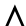

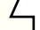

* **格子間のフラックス** (流束)
* **保存性を担保する工夫**
  ガウスの発散定理を用いて非構造格子間のフラック を表していると解釈するこ ス収支を求める問題に変更 し、解析する手法
* 非構造格子 (コントロールボリューム) **が使用可能**

* 2点間 (コントロールボリューム内の点) **でフラックスを求め、**

偏微分方程式を離散化

# 差分法と有限体積法

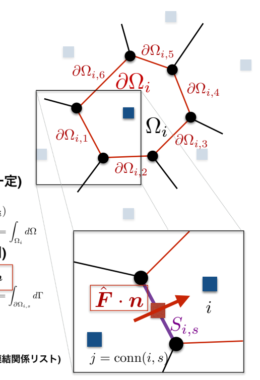

Vi =
一般化保存則
∂φ

* ∇ · F(φ) = S(φ)
  ∂t
  (general conservation law)
  コントロールボリューム (CV) **内で両辺を積分**
  Ωi S(φ)dΩ
  Gauss **の発散定理を適用**
  !

Ωi
∇ · F(φ)dΩ =
!

∂Ωi F(φ) · ndΓ
∂Ωi,s F(φ) · ndΓ =
!

s=1
!

体積積分を近似 (CV**内で物理量が一定**)
!

Ωi
∂φ
∂t dΩ ! Vi
∂φi
∂t ,
!

Ωi S(φ)dΩ ! ViS(φi)
表面積分を近似 (**中点公式・台形則**)
\+
!

6
!

s=1 Si,sFˆ (Fi,Fconn(i,s)) · n
∂Ωi,s F(φ) · ndΓ ! Si,sFˆ (φi, φconn(i,s)) · ndΓ
s=1 Si,sFˆ (φi, φconn(i,s)) · ndΓ = ViS(φi Vi ) ∂φi
∂t +!

6 s=1 Si,sFˆ (φi, φconn(i,s)) · ndΓ = ViS(φi + ) !

6 s=1 Si,sFˆ (Fi,Fconn(i,s)) · n j = conn(i, s): i 番のCV内にある表面 s の向こう側のCV番号を返す関数 (**連結関係リスト**) j = conn(i, s)

# 一般化保存則の離散化

Ωi
"∂φ
∂t + ∇ · F(φ)
\#dΩ =
!

各表面の積分 の和に変形
∂t dΩ +"
6 Ωi
∂φ Ωi S(φ)dΩ
Si,s =
Vi
∂φi
∂t +!

6

# フラックスの計算

これまでの講義の要点
$$V\_{i}\frac{\partial\phi\_{i}}{\partial t};.$$
∂t +!
6
$$+\sum\_{s=1}S\_{i,s}\hat{\mathbf{F}}(\mathbf{F}\_{n}$$
6
s=1 Si,sFˆ (φi, φconn(i,s)) · ndΓ = ViS(φi Vi ) ∂φi
∂t +!

6 s=1 Si,sFˆ (Fi,Fconn(i,s)) · n s=1 Si,sFˆ (φi, φconn(i,s)) · ndΓ = ViS(φi)
移流拡散方程式の場合

$$\frac{\partial\varphi}{\partial t}+\nabla\cdot\mathbf{F}(\phi)=S(\phi)$$

∂φ

∂t + ∇ · F(φ) = S(φ)

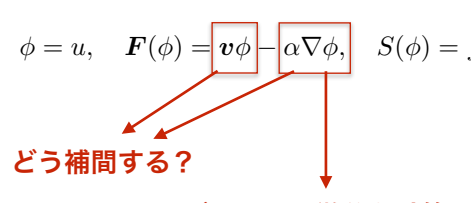

どうやって微分を計算する?

## 1次元 (構造格子) の場合

差分法と同様に、2点以上を用いて補間する高精度モ デルが問題なく使用可能

## 多次元・非構造格子の場合

座標軸に関係なく格子や計算点が配置されているため、
表面に隣接している2**点以外は利用できる保証がない**
→**有限体積法は高次精度化が困難**

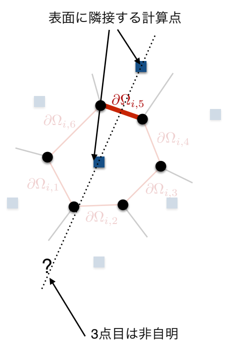

7

# メッシュベース Vs **メッシュフリー**

## メッシュベース法

構造格子: 格子 (メッシュ) が座標に沿って配置

## →差分法など

* 計算点の連結情報が自明であり、
  行列の形も特徴的 (三重対角行列 など) なので、計算コストが低い
* 座標変換による境界適合格子などの工夫が可能だが、空 間の表現に限界がある 非構造格子: 四面体など任意形状のメッシュを使用
  →有限体積法・有限要素法など
* 計算点の連結情報が必要であり、計算コスト が高い
* 複雑形状の対象にも利用できる

## 有限体積法

* **原理的に保存性を有する**

-

* **非構造格子における高次**
  精度化が困難

## メッシュフリー法

→Smoothed Particle Hydrodynamics 法・Element-Free Galerkin 法など

* メッシュ作成のコストやメッシュの歪みによる計算不安定性が少ない
* 表面などの幾何学的情報が一部失われるので、境界等の精度が低い

# 目次

1. **連続体力学と変分法の関係** 2. **有限要素法の基本**
   2.1. **重み付き残差法と弱形式化**
   2.2. Galerkin 法 2.3. 形状関数による補間 3. **安定化有限要素法**
   3.1. Upwind Galerkin 法 3.2. Streamline upwind Petrov/Gakerkin 法 3.3. **その他の安定化スキーム**

# 目次

1. **連続体力学と変分法の関係** 2. **有限要素法の基本**
   2.1. **重み付き残差法と弱形式化**
   2.2. Galerkin 法 2.3. 形状関数による補間 3. **安定化有限要素法**
   3.1. Upwind Galerkin 法 3.2. Streamline upwind Petrov/Gakerkin 法 3.3. **その他の安定化スキーム**

質点系の力学 **剛体の力学**

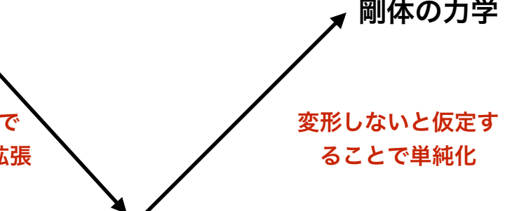

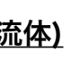

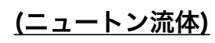

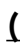

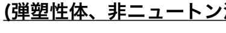

無限個の質点が伱間なく並んで 連続的な分布を形成するよう拡張 連続体力学 レオロジー

固体
(弾性体)
弾性体力学 構造力学 材料力学 流体力学 水理学 流体 = 静止状態においてせん断応力が発生しない連続体
※せん断応力のイメージは、物体表面の接線方向に働く力 連続体力学学習におすすめの書籍: よくわかる連続体力学ノート, 京谷孝史, 森北出版.

11 流体

# 1. 連続体力学と変分法の関係

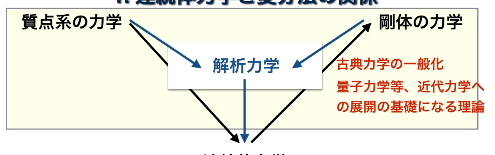

連続体力学

# 1. 連続体力学と変分法の関係

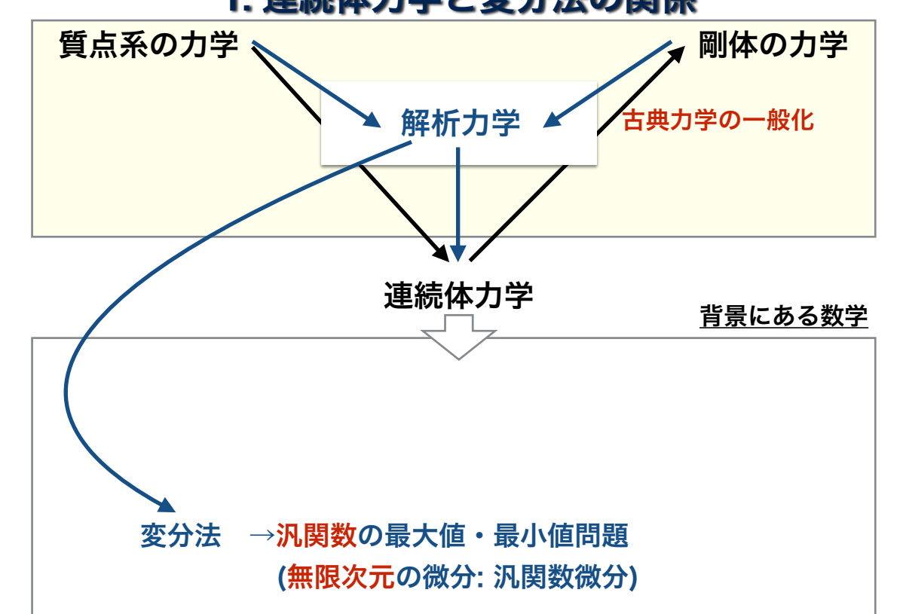

# 1. 連続体力学と変分法の関係

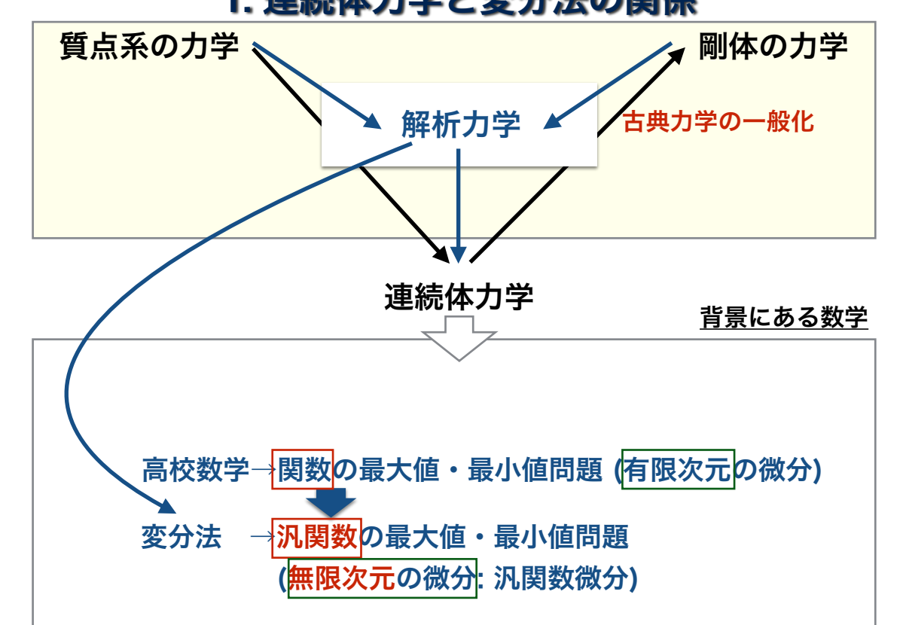

# 1. **連続体力学と変分法の関係**

変分法とは?

高校数学→関数の最大値・最小値問題 (有限次元の微分)
関数: 数値 → 数値 解法: を満たす x を求める 変分法 →汎関数の最大値・最小値問題 (無限次元の微分: 汎関数微分)

# 1. **連続体力学と変分法の関係**

変分法とは?

高校数学→関数の最大値・最小値問題 (有限次元の微分)
関数: 数値 → 数値 解法: を満たす x を求める 変分法 →汎関数の最大値・最小値問題
→**変分問題**
(無限次元の微分: 汎関数微分)
y!=
dy 汎関数: 関数 → 数値 dx

# 1. **連続体力学と変分法の関係**

変分法とは?

高校数学→関数の最大値・最小値問題 (有限次元の微分)
関数: 数値 → 数値 解法: を満たす x を求める 変分法 →汎関数の最大値・最小値問題
→**変分問題**
(無限次元の微分: 汎関数微分)
y!=
dy 汎関数: 関数 → 数値 dx 解法: を満たす (停留関数) を求める
→汎関数微分 (変分) **による解法**
Euler–Lagrange 方程式

# 1. **連続体力学と変分法の関係**

変分法とは?

高校数学→関数の最大値・最小値問題 (有限次元の微分)
関数: 数値 → 数値 解法: を満たす x を求める 変分法 →汎関数の最大値・最小値問題
→**変分問題**
(無限次元の微分: 汎関数微分)
y!=
dy 汎関数: 関数 → 数値 dx 解法: を満たす (停留関数) を求める
→汎関数微分 (変分) **による解法**
Euler–Lagrange 方程式 変分: 関数 を微小に変化させて としたときの汎 y(x) y(x) + δy(x)
関数の微小変化の値で、2次の微小量を無視したもの δI ! I\[y + δy] − I\[y]

# 1. **連続体力学と変分法の関係**

変分法とは?

高校数学→関数の最大値・最小値問題 (有限次元の微分)
関数: 数値 → 数値 解法: を満たす x を求める 変分法 →汎関数の最大値・最小値問題
→**変分問題**
(無限次元の微分: 汎関数微分)
y!=
dy 汎関数: 関数 → 数値 dx 解法: を満たす (停留関数) を求める
→汎関数微分 (変分) による解法 Euler–Lagrange 方程式 最小作用の原理 **(principle of least action):**
力学系の運動は、作用(解析力学で定義される汎関数)が最小にな るような運動である
→力学問題を変分問題として捉えることができる

# 1. **連続体力学と変分法の関係** 変分問題の例

屈折率が連続的に変化する媒質内での光の経路 光の経路: 媒質の屈折率:
光が経路 C (右図の P0 から P1 まで) を通過するのにか かる時間を求める.

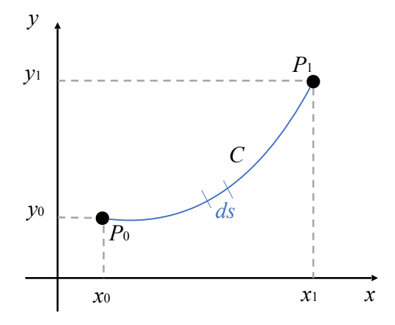

# 1. **連続体力学と変分法の関係** 変分問題の例

屈折率が連続的に変化する媒質内での光の経路 光の経路: 媒質の屈折率:
光が経路 C (右図の P0 から P1 まで) を通過するのにか かる時間を求める.

c を真空中の光の速度とすると、点 (x, y) における光の速度は で与えられ,これを用いると,C 上の微小線素 ds を光が 通過する時間は以下のように表される.

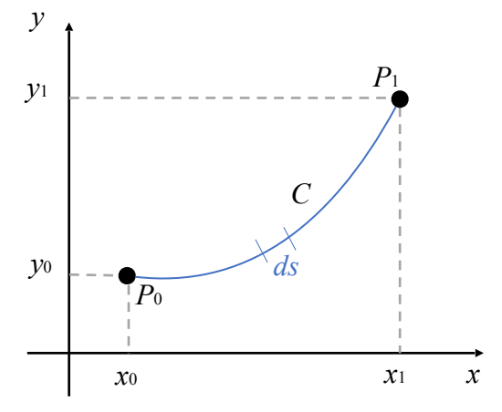

# 1. **連続体力学と変分法の関係** 変分問題の例

屈折率が連続的に変化する媒質内での光の経路 光の経路: 媒質の屈折率:
光が経路 C (右図の P0 から P1 まで) を通過するのにか かる時間を求める.

c を真空中の光の速度とすると、点 (x, y) における光の速度は で与えられ,これを用いると,C 上の微小線素 ds を光が 通過する時間は以下のように表される.

光が経路 C を P0 から P1 まで通過するのにかかる時間は となる.線素 ds の長さ

$$T={\frac{1}{c}}\int\_{x\_{0}}^{x\_{1}}n(y(x)){\sqrt{1+y^{\prime}{(x)}^{2}}}d x$$

を用いて,T は以下のように求められる.

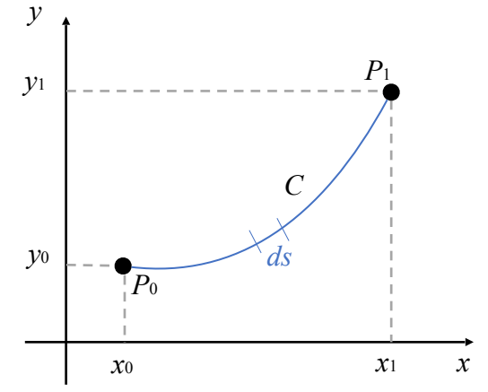

# 1. **連続体力学と変分法の関係** 変分問題の例

屈折率が連続的に変化する媒質内での光の経路 光の経路: 媒質の屈折率:
光が経路 C (右図の P0 から P1 まで) を通過するのにか かる時間を求める.

c を真空中の光の速度とすると、点 (x, y) における光の速度は で与えられ,これを用いると,C 上の微小線素 ds を光が 通過する時間は以下のように表される.

光が経路 C を P0 から P1 まで通過するのにかかる時間は となる.線素 ds の長さ を用いて,T は以下のように求められる.

光は所要時間が最小になるような経路を通る (フェルマーの原理) より,光の経路は とした変分問題の停留関数として求められる.

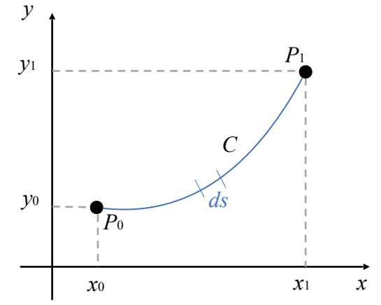

# 1. 連続体力学と変分法の関係

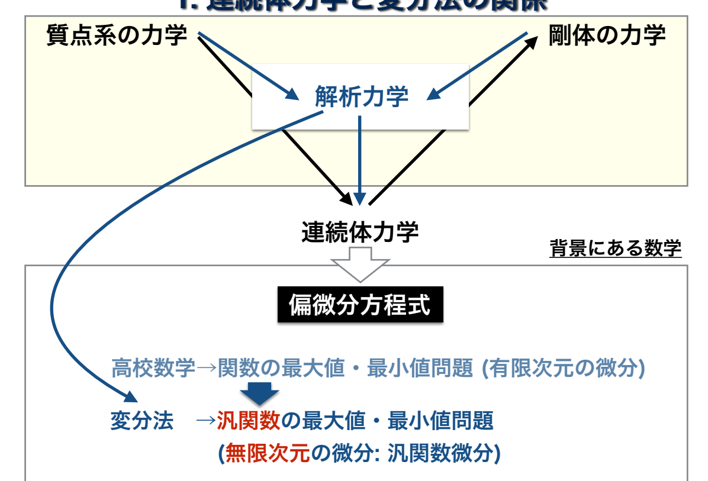

 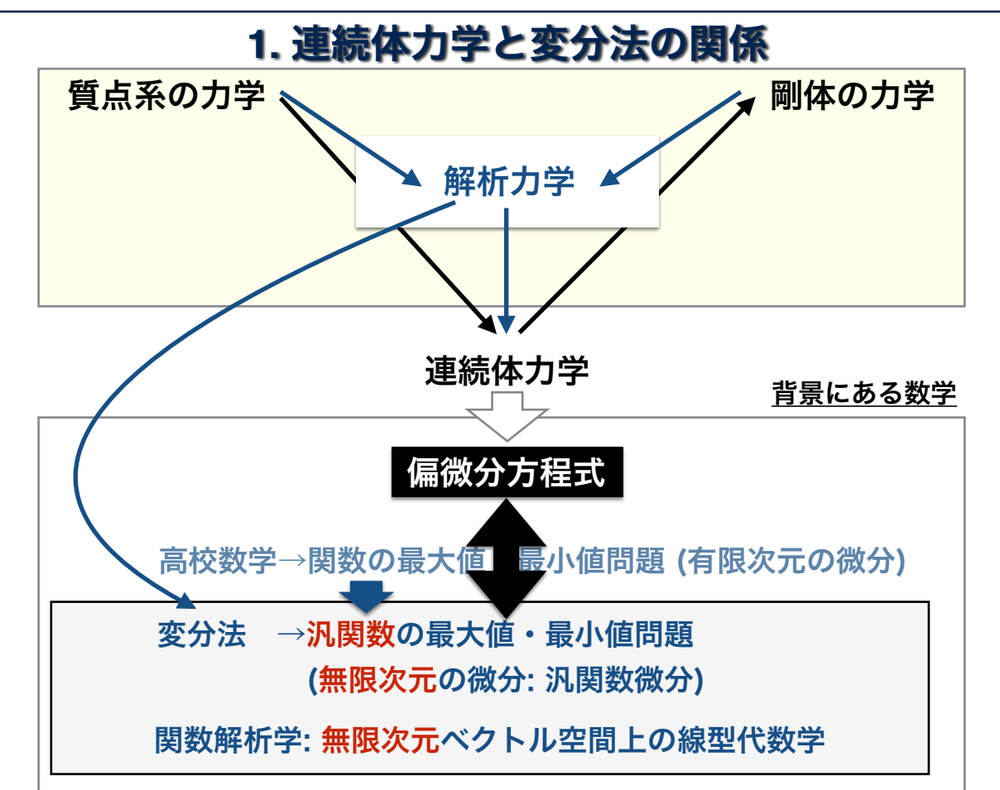

# 1. **連続体力学と変分法の関係**

直交関数展開 関数は無限個の直交関数列として表すことができる 例) **フーリエ級数展開** y(x) = 12 a0 + a1 cos ωx + a2 cos 2ωx + ···

* b1 sin ωx + b2 sin 2ωx + ···

# 1. **連続体力学と変分法の関係** 直交関数展開

関数は無限個の直交関数列として表すことができる

$${\mathcal{I}}=$$

例) **フーリエ級数展開** y(x) = 12 a0 + a1 cos ωx + a2 cos 2ωx + ···

* b1 sin ωx + b2 sin 2ωx + ···

$$\[|{\mathcal{H}}|\mathbb{H}]$$
のフーリエ級数展開

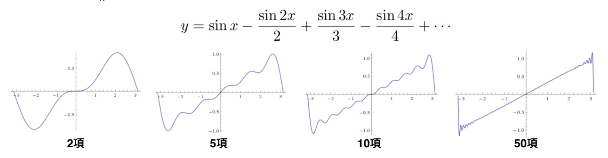

# 1. **連続体力学と変分法の関係** 直交関数展開

関数は無限個の直交関数列として表すことができる y(x) = 12 a0 + a1 cos ωx + a2 cos 2ωx + ···
例) **フーリエ級数展開**

* b1 sin ωx + b2 sin 2ωx + ···
  関数の直交性 ← Euclid の基底ベクトルの直交性 (内積=0) の拡張

$$e\_{x}\cdot e\_{y}=0$$

$$\overline{{e\_{x}\ \overline{{=}}}}$$

0

# 1. **連続体力学と変分法の関係** 直交関数展開

関数は無限個の直交関数列として表すことができる y(x) = 12 a0 + a1 cos ωx + a2 cos 2ωx + ···
例) **フーリエ級数展開**

$\mathbf{a}=\mathbf{a}\cdot\mathbf{a}$.

* b1 sin ωx + b2 sin 2ωx + ···
  関数の直交性 ← Euclid の基底ベクトルの直交性 (内積=0) の拡張 三角関数の直交性

$$(m=n)$$
$$\overline{{2}}$$
$\mathbf{M}$
$\blacksquare$
$\downarrow$ .
$$(m\neq n)$$
$$X$$
$$(m=n)$$
$$\overline{{2}}$$
$\mathrm{~s~}$
$\not\equiv;\eta\_{\mu}$)
$\downarrow$ .
ex · ey = 0

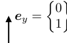

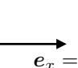

"
$$x\prime\cos x$$

# $\sin(n\omega x)\sin(m\omega x)dx=$  .

(Fourier 級数展開における関数の直交性) ex =

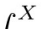

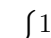

0
"

# 1. 連続体力学と変分法の関係 直交関数展開

関数は無限個の直交関数列として表すことができる
\= = a0 + a1 cos wx + a2 cos 2wx + · · ·
例) フーリエ級数展開 y(x)

* b1 sin wx + b2 sin 2wx + · ·
  関数の直交性 ← Euclid の基底ベクトルの直交性 (内積=0) の拡張

(0)

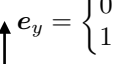

三角関数の直交性 ex ・ey = ()

(1)

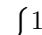

ex

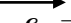

(Fourier 級数展開における関数の直交性)
rX
X
\~
(m = n)
直交関数の例(ルジャンドル展開)
Po = 1 P1 = x P2 = = (3x2 - 1)
P3 = = (5x3 - 3x)

$$,^{2}+3)$$

P4 = = (35x4 - 30x2 + 3)

$$P\_{5}={\frac{1}{8}}\left(65x^{5}-70x^{3}+15x\right)$$

| 0 | Jo cos(nwx) cos(mwx)dx =

$\mathbf{P}*{\rm f}=\mathbf{P}*{\rm f}\mathbf{P}\_{\rm f}$ (10.10)
0

$$(m\neq n)$$

rX

$$\overline{{2}}$$

$$(m=n)$$

sin(nwx) sin(mwx)dx =
Jo

$$\mathbf{v}*{i}=\mathbf{v}*{i}$$

0

$\mathcal{L}\_{\infty}\infty$
(m ≠ n)
rX
cos(nwx)sin(mwx)dx = 0 Jo X

# 1. **連続体力学と変分法の関係** 直交関数展開

関数は無限個の直交関数列として表すことができる

y(x) = 12 a0 + a1 cos ωx + a2 cos 2ωx + ··· 例) フーリエ級数展開

* b1 sin ωx + b2 sin 2ωx + ···

a =   a1 a2 ...  関数 → 直交関数を基底とした無限次元空間内の一点  y(x) = !∞ i=1 aiφi(x) φi : i 番目の基底関数

# 1. **連続体力学と変分法の関係**

直交関数展開

$$\exists\exists\exists\forall i\exists i\exists i\exists i\exists i\exists i\exists i$$

関数は無限個の直交関数列として表すことができる

y(x) = 12 a0 + a1 cos ωx + a2 cos 2ωx + ··· 例) フーリエ級数展開 + b1 sin ωx + b2 sin 2ωx + ···
a =   a1 a2 ...  関数 → 直交関数を基底とした無限次元空間内の一点  y(x) = !∞ i=1 aiφi(x) φi : i 番目の基底関数
偏微分方程式は関数を入力し、(初期条件等の) 関数を解の関数に移す写像 線形写像の場合は、無限次元空間内における線形代数学 関数解析学

# 1. **連続体力学と変分法の関係** 変分法における近似解法

変分法 →汎関数の最大値・最小値問題
→**変分問題**
(無限次元の微分: 汎関数微分)
y!=
dy 汎関数: 関数 → 数値 dx

解法: を満たす (停留関数) を求める
→汎関数微分 (変分) **による解法**

$$\cdot\prod^{\prime};,$$

Euler–Lagrange 方程式 関数 → 直交関数を基底とした無限次元空間内の一点

$$a=,$$

$$\mathcal{L}$$

a1 a2
...

$$\exists\exists\exists\exists\forall\exists\exists\exists\exists\exists\exists\exists$$
$\square$
$$\overline{{{\left|\begin{array}{l l}{y(x)=\sum a\_{i}\phi\_{i}(x)}\end{array}\right.}}}$$
$\mathbf{a}\cdot\mathbf{b}=\mathbf{a}\cdot\mathbf{b}$.
i=1
$$\exists\exists\exists\exists\exists\forall\exists\neg}$$

φi
: i **番目の基底関数**

# 1. **連続体力学と変分法の関係** 変分法における近似解法

変分法 →汎関数の最大値・最小値問題
→**変分問題**
(無限次元の微分: 汎関数微分)
y!=
dy 汎関数: 関数 → 数値 dx 解法: を満たす (停留関数) を求める
→汎関数微分 (変分) **による解法**
Euler–Lagrange 方程式 有限個の基底関数で近似

a =

関数 → 直交関数を基底とした無限次元空間内の一点

$\blacksquare$
a1 a2
...

$$\Xi\[\overline{{{\mathcal{H}}}}],\widetilde{\mathcal{H}}$$
$$\mathbf{\hat{\Sigma}}=\mathbf{\hat{\Sigma}}$$
$\square$
$\square$
y(x) = !∞

$\zeta$

i=1 aiφi(x)
φi
: i **番目の基底関数**

# 1. **連続体力学と変分法の関係** 変分法における近似解法

変分法 →汎関数の最大値・最小値問題
→**変分問題**
(無限次元の微分: 汎関数微分)
汎関数: 関数 → 数値 y!=
dy dx 解法: を満たす (停留関数) を求める
→汎関数微分 (変分) **による解法**
Euler–Lagrange 方程式 近似された関数に対する変分法 変分法の近似解法 (Ritz 法, Galerkin 法など)

有限個の基底関数で近似

a =

関数 → 直交関数を基底とした無限次元空間内の一点 a1 a2
...

y(x) = !∞
i=1 aiφi(x)
φi
: i **番目の基底関数**

# 目次

1. 連続体力学と変分法の関係 2. **有限要素法の基本**
   2.1. **重み付き残差法と弱形式化**
   2.2. Galerkin 法 2.3. **形状関数による補間**

2. **安定化有限要素法**
   3.1. Upwind Galerkin 法 3.2. Streamline upwind Petrov/Gakerkin 法 3.3. **その他の安定化スキーム**

3. **有限要素法の基本**
   有限要素法とは?

偏微分方程式に対して重み付き残差法を適用し弱形式化した上で、
メッシュの形状に対応した関数 (形状関数) を基底関数とした変分 法の近似解法 (Galerkin 法など) を用いて解析する手法 形状関数 **(shape function)**

2.1. **重み付き残差法と弱形式化**
2.2. Galerkin 法 2.3. 形状関数による補間

## Https://Www.Comsol.Jp/Multiphysics/Finite-Element-Method

2. **有限要素法の基本**
   有限要素法とは?

偏微分方程式に対して**重み付き残差法を適用し弱形式化**した上で、
メッシュの形状に対応した関数 (形状関数) を基底関数とした変分 法の近似解法 (Galerkin 法など) を用いて解析する手法 2.1. **重み付き残差法と弱形式化**
2.2. Galerkin 法 2.3. 形状関数による補間 形状関数 **(shape function)**

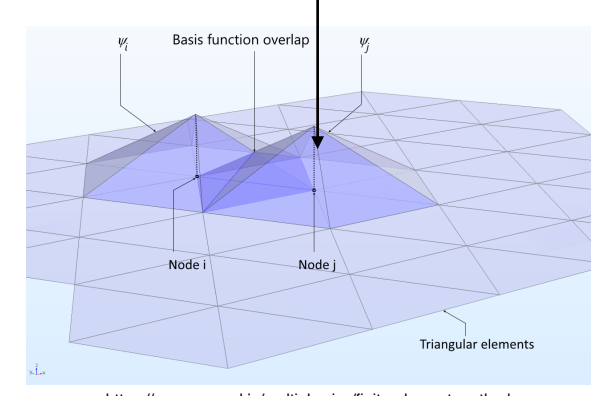

## Https://Www.Comsol.Jp/Multiphysics/Finite-Element-Method

# 2.1. **重み付き残差法と弱形式化** 重み付き残差法 (Weighted Residual Method)

移流拡散方程式:
(convection–diffusion equation)

$${\frac{\partial u}{\partial t}}+(v\cdot\nabla)u=\alpha\nabla^{2}u+f$$
$$\begin{array}{c}{{\bigstar\bigstar}}\ {{\bigstar}}\ {{\bigstar}}\end{array}$$
$$r(\mathbf{x},t)={\frac{\partial u}{\partial t}}+(\mathbf{v}\cdot\nabla)u-\alpha\nabla^{2}u-f$$
$$(\mathrm{residual})$$

# 2.1. 重み付き残差法と弱形式化 重み付き残差法 **(Weighted Residual Method)**

移流拡散方程式:
(convection–diffusion equation)
∂u
∂t + (v · ∇)u = α∇2u + f

$\mathbf{v}$

$$\bar{f}*{\pm}^{\pm}\bar{\frac{\phi*{\pm}}{\sqrt{\pm}}}.$$
$|\boldsymbol{a}|$).
$$r(\mathbf{x},t)={\frac{\partial u}{\partial t}}+(\mathbf{v}\cdot\nabla)u-\alpha\nabla^{2}u-f$$
(residual)
重み付き残差方程式 **(weighted residual equation):**
偏微分方程式の残差に重み関数を掛けて対象領域で積分した方程式
!

!

Ω
w(x)r(x, t)dΩ = 0 Ω
w(x)r: (x重み関数 , t)dΩ = 0 (weight function)

# 2.1. 重み付き残差法と弱形式化 重み付き残差法 **(Weighted Residual Method)**

移流拡散方程式:
(convection–diffusion equation)

$${\frac{\partial u}{\partial t}}+(v\cdot\nabla)u=\alpha\nabla^{2}u+f$$
$\bullet$  b.
!
$${\mathcal{D}}\uparrow\mp\mathbb{D}\cup$$ $$\mathrm{\mathrm{~quation}}$$
$\mathbf{v}$
$$\bar{\mathcal{Y}}*{\overline{{{X}}}}^{\pm}\bar{\frac{\bar{\mathcal{Y}}*{\pm}}{\bar{\mathcal{L}}\_{\pm}}}.$$
$\mathsf{LL}$).
(residual)

$$r(\mathbf{x},t)={\frac{\partial u}{\partial t}}+(\mathbf{v}\cdot\nabla)u-\alpha\nabla^{2}u-f$$

重み付き残差方程式 **(weighted residual equation):**
偏微分方程式の残差に重み関数を掛けて対象領域で積分した方程式
!

!

Ω
w(x)r(x, t)dΩ = 0 Ω
w(x)r: (x重み関数 , t)dΩ = 0 (weight function)

Ω
$$\mathbf{\partial}\left(\mathbf{\partial}\mathbf{x}\right)\left({\frac{\partial u}{\partial t}}+(\mathbf{v}\cdot\nabla)u-\alpha\nabla^{2}u-f\right)d\Omega=0$$

# 2.1. 重み付き残差法と弱形式化

重み付き残差法 **(Weighted Residual Method)**
重み付き残差方程式 **(weighted residual equation):**

$$\int\_{\Omega}w(\mathbf{x})\left({\frac{\partial u}{\partial t}}+(\mathbf{v}\cdot\nabla)u-\alpha\nabla^{2}u-f\right)d\Omega=0\qquad\mathbf{\cdot,\cdot,,,(1)}$$
$$\frac{1}{180}\frac{1}{7}\frac{1}{7}\frac{1}{14}\left(\mathrm{~boundary~conditions}\right):$$
境界条件 **(boundary conditions):** ∂Ω = ∂ΩD + ∂ΩN
Neumann **境界の表面**

$$\partial\Omega=*{\star}\partial\Omega*{D}+\partial\Omega\_{\mu}$$
$$\blacksquare$$

Dirichlet **境界の表面**
2.1. 重み付き残差法と弱形式化 重み付き残差法 **(Weighted Residual Method)**
重み付き残差方程式 **(weighted residual equation):**

$$\int\_{\Omega}w(\mathbf{x})\left({\frac{\partial u}{\partial t}}+(\mathbf{v}\cdot\nabla)u-\alpha\nabla^{2}u-f\right)d\Omega=0\qquad\mathbf{\cdot}\ \mathbf{\cdot}\ \mathbf{\cdot}\ \mathbf{(1)}$$

境界条件 **(boundary conditions):** ∂Ω = ∂ΩD + ∂ΩN
Neumann **境界の表面**
Dirichlet **境界の表面**
Dirichlet **境界条件**:
u = uD
解 u は境界条件を満たすように設定し、重み関数は境界上で 0 とする 2.1. 重み付き残差法と弱形式化 重み付き残差法 **(Weighted Residual Method)**
重み付き残差方程式 **(weighted residual equation):**

$$\int\_{\Omega}w(\mathbf{x})\left({\frac{\partial u}{\partial t}}+(\mathbf{v}\cdot\nabla)u-\alpha\nabla^{2}u-f\right)d\Omega=0\qquad\mathbf{\cdot}\ \mathbf{\cdot}\ \mathbf{\cdot}\ \mathbf{(1)}$$

境界条件 **(boundary conditions):** ∂Ω = ∂ΩD + ∂ΩN
Neumann **境界の表面**
Dirichlet **境界の表面**
Dirichlet **境界条件**:
u = uD
解 u は境界条件を満たすように設定し、重み関数は境界上で 0 とする Neumann **境界条件**:
α (∇u) · n = qN

# 2.1. 重み付き残差法と弱形式化 重み付き残差法 **(Weighted Residual Method)**

重み付き残差方程式 **(weighted residual equation):**

$$\int\_{\Omega}w(\mathbf{x})\left({\frac{\partial u}{\partial t}}+(\mathbf{v}\cdot\nabla)u-\alpha\nabla^{2}u-f\right)d\Omega=0\qquad\mathbf{\cdot}\ \mathbf{\cdot}\ \mathbf{\cdot}\ \mathbf{(1)}$$
!
境界条件 **(boundary conditions):** ∂Ω = ∂ΩD + ∂ΩN
Neumann **境界の表面**
Dirichlet **境界の表面**
Dirichlet **境界条件**:
u = uD
解 u は境界条件を満たすように設定し、重み関数は境界上で 0 とする Neumann **境界条件**:
α (∇u) · n = qN
重み付き残差法を用いて定式化
∂ΩN
w(x) (α (∇u) · n − qN ) dΓ = 0
・・・(2)

# 2.1. 重み付き残差法と弱形式化 重み付き残差法 **(Weighted Residual Method)**

$$\int\_{\Omega}w(\mathbf{x})\left({\frac{\partial u}{\partial t}}+(\mathbf{v}\cdot\nabla)u-\alpha\nabla^{2}u-f\right)d\Omega=0\qquad\mathbf{\cdot,\cdot,,,(1)}$$

Dirichlet **境界条件**: 解 u は境界条件を満たすように設定し、重み関数は境界上で 0 とする
!

∂ΩN w(x) (α (∇u) · n − qN ) dΓ = 0 ・・・(2)
Neumann 境界条件:

# 2.1. 重み付き残差法と弱形式化 重み付き残差法 **(Weighted Residual Method)**

$$\int\_{\Omega}w(\mathbf{x})\left({\frac{\partial u}{\partial t}}+(\mathbf{v}\cdot\nabla)u-\alpha\nabla^{2}u-f\right)d\Omega=0\qquad\mathbf{\cdot,\cdot,,\cdot,,(1)}$$
$$\Xi\bigcup{}\_{\lambda}$$
$$\frac{\pi}{2}$$  2.

!
Dirichlet **境界条件**: 解 u は境界条件を満たすように設定し、重み関数は境界上で 0 とする Neumann **境界条件**:

$$#\ u\ {\pm\frac{1}{2\pi}\mp\frac{1}{2\pi}\pm\frac{1}{1!!!!}}\pm\frac{1}{2\pi}\mp\frac{1}{2\pi}\pm\frac{1}{2\pi}$$
$${\mathcal{H}}\_{\Gamma}^{\mu}:\qquad\oint$$
$\square$
!

$${\overline{{\Xi}}},{\mathcal{D}}!!!!/,{\overline{{\Xi}}}$$
$$\zeta(\pm\pm\pm\mp\mp\mp0\pm\mp\mp)$$
$=;\pm;10$ .
$$\left(2\right)$$

・・・(2)

$$\rho\psi(\infty)\left(\infty\left(\nabla\rho\right)\cdot\infty\right)$$

∂ΩN
w(x) (α (∇u) · n − qN ) dΓ = 0 境界条件を考慮した重み付き残差方程式:

$${\mathfrak{C}}\setminus{\mathfrak{C}}$$
Ω
w(x)
$$\left({\frac{\partial u}{\partial t}}+(v\cdot\nabla)u-\alpha\nabla^{2}u-f\right)$$
$\blacksquare$
\#dΩ +
!

∂ΩN
w(x) (α (∇u) · n − qN ) dΓ = 0

# 2.1. 重み付き残差法と弱形式化 重み付き残差法 **(Weighted Residual Method)**

$$\int\_{\Omega}w(\mathbf{x})\left({\frac{\partial u}{\partial t}}+(\mathbf{v}\cdot\nabla)u-\alpha\nabla^{2}u-f\right)d\Omega=0\qquad\mathbf{\cdot}\ \mathbf{\cdot}\ \mathbf{\cdot}\ \mathbf{(1)}$$
Ω
w(x)
"∂u
!
∂t
Dirichlet 境界条件: 解 u は境界条件を満たすように設定し、重み関数は境界上で 0 とする ! ・・・(2) ∂ΩN w(x) (α (∇u) · n − qN ) dΓ = 0 Neumann 境界条件:
境界条件を考慮した重み付き残差方程式:

$$\int\_{\Omega}w(\mathbf{x})\left({\frac{\partial u}{\partial t}}+(\mathbf{v}\cdot\nabla)u-\alpha\nabla^{2}u-f\right)d\Omega+\int\_{\partial\Omega\_{N}}w(\mathbf{x})\left(\alpha\left(\nabla u\right)\cdot\mathbf{n}-q\_{N}\right)d\Gamma=0$$

* (v · ∇)u − α∇2u − f
  \#dΩ −
  !
  ∂ΩN
  w(x) (α (∇u) · n − qN ) dΓ = 0 重み関数 w は任意の値をとり、 上で 0 である場合も含む
  →上式の右辺第2項が消え、Neumann 境界条件なしの式が成立

# 2.1. 重み付き残差法と弱形式化 重み付き残差法 **(Weighted Residual Method)**

Ω w(x) "∂u ∂t + (v · ∇)u − α∇2u − f #dΩ = 0 ! ・・・(1)
Ω
w(x)
"∂u
!
∂t
Dirichlet 境界条件: 解 u は境界条件を満たすように設定し、重み関数は境界上で 0 とする
Neumann **境界条件**:

! ・・・(2) ∂ΩN w(x) (α (∇u) · n − qN ) dΓ = 0
境界条件を考慮した重み付き残差方程式:

$$\int\_{\Omega}w(\mathbf{x})\left({\frac{\partial u}{\partial t}}+(\mathbf{v}\cdot\nabla)u-\alpha\nabla^{2}u-f\right)d\Omega+\int\_{\partial\Omega\_{N}}w(\mathbf{x})\left(\alpha\left(\nabla u\right)\cdot\mathbf{n}-q\_{N}\right)d\Gamma=0$$

* (v · ∇)u − α∇2u − f
  \#dΩ −
  !
  ∂ΩN
  w(x) (α (∇u) · n − qN ) dΓ = 0 重み関数 w は任意の値をとり、 上で 0 である場合も含む
  →上式の右辺第2項が消え、Neumann 境界条件なしの式が成立 u がもとの方程式を満たす (解である) 場合
  →上式の右辺第1項が消え、Neumann 境界条件の式が成立

# 2.1. 重み付き残差法と弱形式化 弱形式化 **(Weak Formulation)**

境界条件を考慮した重み付き残差方程式:

$$\int\_{\Omega}w(x)\left({\frac{\partial u}{\partial t}}+(v\cdot\nabla)u-{\overline{{\left|\alpha\nabla^{2}u\right|}}}\right)$$
$$\left({\frac{\partial u}{\partial t}}+\left(\mathbf{v}\cdot\nabla\right)u-{\boxed{\alpha\nabla^{2}u}}-f\right)d\Omega+\int\_{\partial\Omega\_{N}}w(\mathbf{x})\left(\alpha\left(\nabla u\right)\cdot\mathbf{n}-q\_{N}\right)d\Gamma=0$$
※ 解 u は境界条件を満たすように設定し、重み関数は境界上で 0
Gauss–Green の定理を使って、2階微分を1**階微分に変換** → 弱形式化 **(weak formulation)**

# 2.1. **重み付き残差法と弱形式化** 弱形式化 **(Weak Formulation)**

境界条件を考慮した重み付き残差方程式:

$$\int\_{\Omega}w(\mathbf{x})\left({\frac{\partial u}{\partial t}}+(\mathbf{v}\cdot\nabla)u-{\frac{\left|\alpha\nabla^{2}u\right|}{\blacksquare}}\right)$$
$$\begin{array}{c}{{\left({\frac{\partial u}{\partial t}}+\left(\mathbf{v}\cdot\nabla\right)u-\left|\alpha\nabla^{2}u\right|-f\right)d\Omega+\int\_{\partial\Omega\_{N}}w(\mathbf{x})\left(\alpha\left(\nabla u\right)\cdot\mathbf{n}-q\_{N}\right)d\Gamma=0}}\ {{\left.\right|}}\ {{\left.\right|}}\ {{\left.\right|}}\end{array}$$
Ω
α(∇w) · (∇u)dΩ
Gauss–Green の定理を使って、2階微分を1階微分に変換
→ 弱形式化 **(weak formulation)**

# $$\int\_{\Omega}w(\alpha\nabla^{2}u)d\Omega=\int\_{\partial\Omega}w\alpha(\nabla u)\cdot n d\Gamma-\int\_{\Omega}\alpha(\nabla w)\cdot(\nabla u)d\Omega$$

!
∂ΩN
wα(∇u) · ndΓ −
!

# 2.1. **重み付き残差法と弱形式化** 弱形式化 **(Weak Formulation)**

境界条件を考慮した重み付き残差方程式:

! Ω w(x) "∂u ∂t + (v · ∇)u − α∇2u − f #dΩ + ! ∂ΩN w(x) (α (∇u) · n − qN ) dΓ = 0 ※ 解 u は境界条件を満たすように設定し、重み関数は境界上で 0 Gauss–Green の定理を使って、2階微分を1階微分に変換 → 弱形式化 (weak formulation) ! Ω w(α∇2u)dΩ = ! ∂Ω wα(∇u) · ndΓ − ! ! Ω w(α∇2u)dΩ = ! ∂Ω wα(∇u) · ndΓ − ! Ω α(∇w) · (∇u)dΩ Ω α(∇w) · (∇u)dΩ = ! ∂ΩN wα(∇u) · ndΓ − ! = ! ∂ΩN wα(∇u) · ndΓ − ! Ω α(∇w) · (∇u)dΩ Ω α(∇w) · (∇u)dΩ
∂Ω = ∂ΩD + ∂ΩN
Neumann **境界の表面**
Dirichlet **境界の表面**

# 2.1. **重み付き残差法と弱形式化** 弱形式化 **(Weak Formulation)**

! Ω w(x) "∂u ∂t + (v · ∇)u − α∇2u − f #dΩ + ! ∂ΩN w(x) (α (∇u) · n − qN ) dΓ = 0 ※ 解 u は境界条件を満たすように設定し、重み関数は境界上で 0 Gauss–Green の定理を使って、2階微分を1階微分に変換 → 弱形式化 (weak formulation)
境界条件を考慮した重み付き残差方程式:

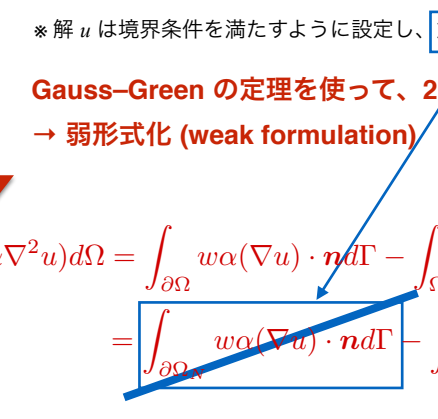

$$\frac{\operatorname\*{lim}*{(\nabla u)\cdot\mathcal{M}}}{\operatorname\*{lim}*{(\Delta\setminus\Delta)\to\Delta}}\int\_{\Omega}\alpha(\nabla w)\cdot(\nabla u)d\Omega$$

# 2.1. **重み付き残差法と弱形式化** 弱形式化 **(Weak Formulation)**

境界条件を考慮した重み付き残差方程式:

!
$$\begin{array}{c}{{r\atop\Omega}}\ {{w(\mathbf{x})\left({\frac{\partial u}{\partial t}}+(\mathbf{v}\cdot\nabla)u-\overline{{{\left|\alpha\nabla^{2}u\right|}}}-f\right)d\Omega+\int\_{\partial\Omega\_{N}}w(\mathbf{x})\left(\underline{{{\alpha\mathbf{\Sigma^{*}\mathbf{\Sigma^{*}\mathbf{n}}}}}}-q\_{N}\right)d\Gamma=0}}\end{array}$$
!
※ 解 u は境界条件を満たすように設定し、重み関数は境界上で 0

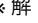

Gauss–Green の定理を使って、2階微分を1**階微分に変換**

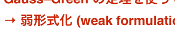

$$\int\_{\Omega}w(\alpha\nabla^{2}u)d\Omega=\underbrace{\int\_{\partial\Omega}w\alpha(\nabla u)}\_{\partial\Omega}$$
wα(∇u) · ndΓ − ! wα(∇u) · ndΓ − ! Ω α(∇w) · (∇u)dΩ Ω α(∇w) · (∇u)dΩ
===================================================================

!

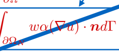

$$\prod\_{\Omega},\alpha(\nabla w)\cdot(\nabla u)d\Omega$$

\=
!
弱形式化された重み付き残差方程式:

Ω
w
$$\left({\frac{\partial u}{\partial t}}+(\mathbf{v}\cdot\nabla)u-f\right)d\Omega+\int\_{\Omega}\alpha\left(\nabla w\right)\cdot\left(\nabla u\right)d\Omega-\int\_{\partial\Omega\_{N}}w q\_{N}d\Gamma=0$$
※ 解 u は Dirichlet 境界条件を満たすように設定

2. **有限要素法の基本**
   有限要素法とは?

偏微分方程式に対して重み付き残差法を適用し弱形式化した上で、
メッシュの形状に対応した関数 (形状関数) を基底関数とした変分 法の近似解法 (Galerkin 法など) を用いて解析する手法 形状関数 **(shape function)**

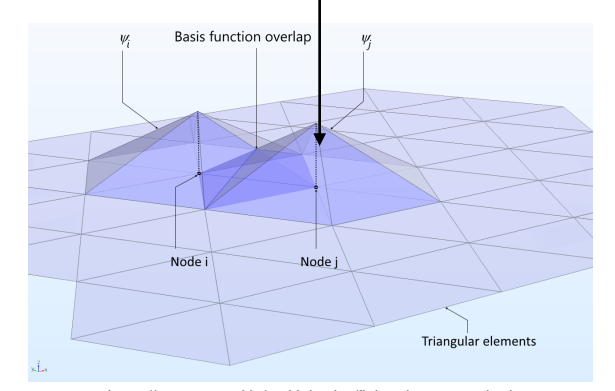

2.1. **重み付き残差法と弱形式化**
2.2. Galerkin 法 2.3. 形状関数による補間

## Https://Www.Comsol.Jp/Multiphysics/Finite-Element-Method

弱形式化された重み付き残差方程式:
Ω
w
"∂u
∂t + (v · ∇)u − f
\#dΩ +
!

!

Ω
α (∇w) · (∇u) dΩ −
!

∂ΩN
wqN dΓ = 0
※ 解 u は Dirichlet 境界条件を満たすように設定 Galerkin 法:
重み関数と解を有限個の基底関数で近似した上で、双方に同一の基底 関数を用いる手法

$\mathbf{a}\in\mathbb{R}^n$
弱形式化された重み付き残差方程式:

!
Ω
w
$$\left(\partial u\right.$$
$$\exists\exists\forall\forall\exists\exists\exists\exists\exists\exists$$
$$+,({\boldsymbol{v}}\cdot\nabla){\boldsymbol{u}}-{\boldsymbol{f}}^{\prime}$$
$$\overline{{{\mathcal{O}}{\mathcal{H}}}}$$
\#dΩ +
!
Ω
$$\left(\nabla w\right)\cdot\left(\nabla u\right)d\Omega-\int\_{\partial\Omega}$$
$$\mathbf{\Sigma}\_{d}\perp!!!\perp$$
$\square$
!

∂ΩN
wqN dΓ = 0

※ 解 u は Dirichlet 境界条件を満たすように設定 Galerkin 法:
重み関数と解を有限個の基底関数で近似した上で、双方に同一の基底 関数を用いる手法

$$w(x)\simeq w\_{h}(x)=\sum\_{i=1}^{m}w\_{i}N\_{i}(x)$$
$$M$$
$${\dot{\imath}}{\underline{{=}}}1$$
u(x) ! uh(x) = ! i=1 uiNi(x) ※ 解 u は Dirichlet 境界条件を満たすように設定
$$M$$
